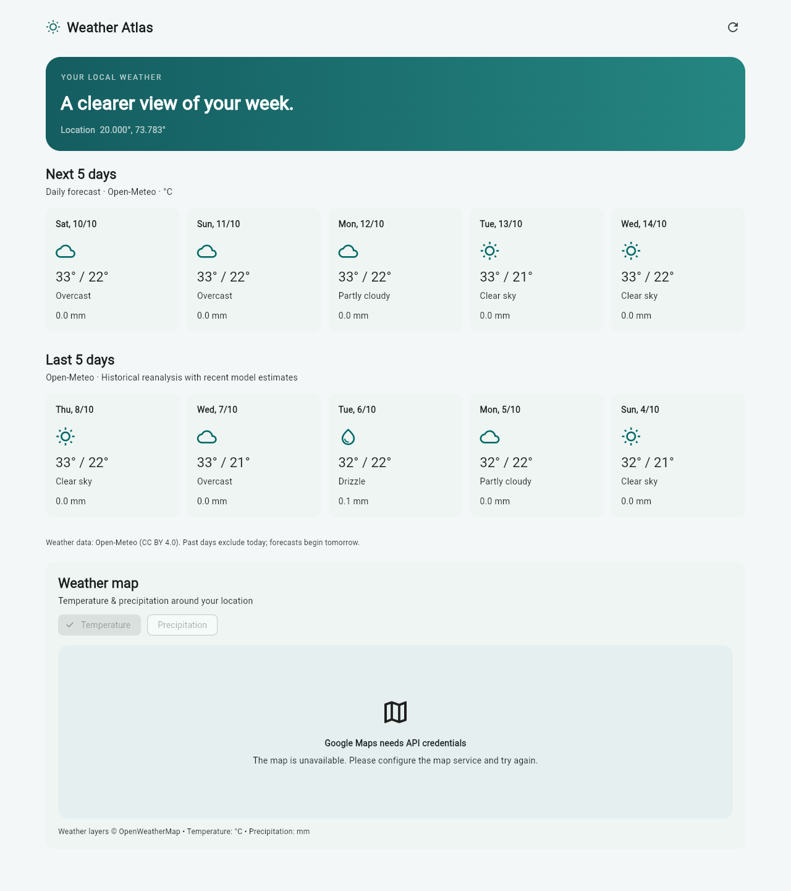
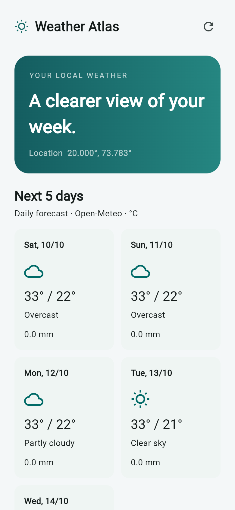
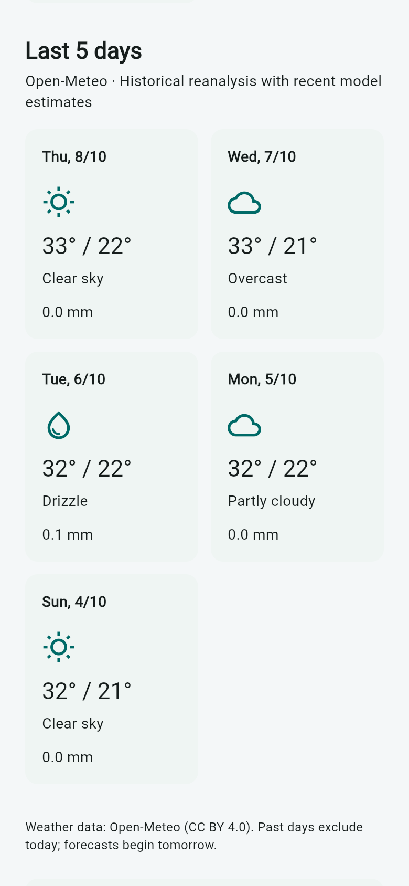

# Weather Atlas

A Flutter weather app for Android and Web, with forecasts and recent weather history based on your location.

## Features

- Five-day forecast with minimum/maximum temperature and precipitation.
- Previous five days of weather history, with recent model estimates labeled.
- Google Maps with temperature and precipitation layers when API keys are configured.
- Responsive dashboard and installable Web app (PWA).

## Screenshots

**Desktop browser**



**Mobile browser previews**

| Forecast | Recent history |
| --- | --- |
|  |  |

Browser preview using Nashik, my current location. Maps require API keys. Mobile previews use a phone-sized browser viewport.

## Run locally

Requires Flutter with Dart 3.9.2 or a compatible newer version, plus Chrome or an Android device/emulator.

```bash
flutter pub get
flutter run -d chrome
```

Allow location access. Web location requires localhost or HTTPS. Forecasts use Open-Meteo by default, with no API key required for non-commercial use.

## Maps configuration

Copy `config.example.json` to `config.json` and fill in:

- `GOOGLE_MAPS_API_KEY`: enable Maps JavaScript API for Web or Maps SDK for Android.
- `OPENWEATHER_API_KEY`: required for temperature and precipitation map layers.
- `USE_OPENWEATHER`: leave `false` to use Open-Meteo forecasts.

Use restricted API keys and enable Google Maps billing. `config.json` is ignored by Git. Run through the helper to load the configuration:

```powershell
./tool/run.ps1 -Action run -Device chrome
# Android: replace chrome with your device ID from flutter devices.
```

## Build and checks

```powershell
flutter analyze
flutter test
./tool/run.ps1 -Action web
./tool/run.ps1 -Action apk
```

Weather data: [Open-Meteo](https://open-meteo.com/) (CC BY 4.0). Weather map layers: [OpenWeatherMap](https://openweathermap.org/).
